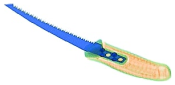
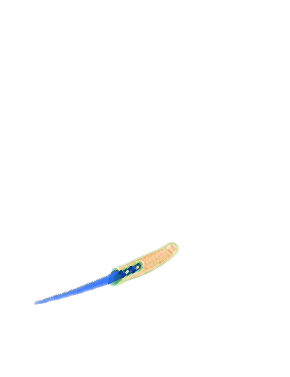
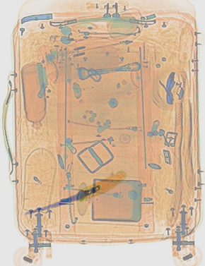

# BaggageAI
Baggage AI Internship task activity
Algorithm to implement:
## 1. Extracting cropped threat image from threat images given.
#### -> Converting image to gray scale
#### -> Converted image values to process ahead
#### -> Contours for nonZero coordinates found
#### -> Cropped with respect to the contours
#### -> Due to first conversion the inversion is happened so reverting back BGR2RGB
#### -> Thus, final cropped image is extracted for threats

## 2. Blank background to change size of threat image as per selected background image (290, 377)

## 3. Resizing image to add weights with background and performing transformations (using Pillow)
#### -> Blank background stored
#### -> Threat image scaled by 1/2 factor
#### -> scaled image rotated by 45 degrees and expand color is set to white with expansion true
#### -> threat is blured and alpha is set to 188 so as to get it respectively translucent while weight addition
#### -> threat image mask is selected and main threat is extracted from the rectangular boundary

#### -> This threat is further used for pasting on white background with specific translations to have it inside the bag
#### -> Thus threat image with white background of selected background size is formed

## 4. Adding weights of threat transformed image and selected background image in order to keep it transparent
#### -> selected background is stored
#### -> threat images transformed are stored in overlay
#### -> opacity for backrgound and overlay is set to 0.4 and 0.5 respecitively done by hit and trial
#### -> Thus the weights are added and output combined image is found

